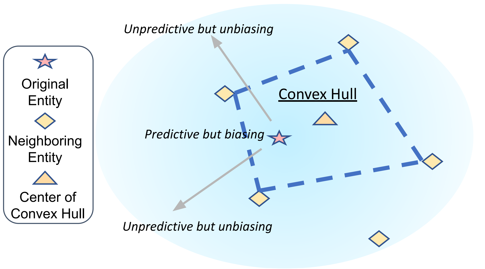

# Causal View of Entity Bias

Code for our paper [A Causal View of Entity Bias in (Large) Language Models](https://arxiv.org/abs/2305.14695) in Findings of EMNLP 2023.



## Dataset
The TACRED dataset can be obtained from [this link](https://nlp.stanford.edu/projects/tacred/). The ENTRED dataset can be obtained from [this link](https://github.com/wangywUST/RobustRE). The expected structure of files is:
```
 |-- data
 |    |-- tacred
 |    |    |-- train.json        
 |    |    |-- dev.json
 |    |    |-- test.json
 |    |    |-- test_entred.json
```

## Requirements
```bash
pip install -r requirements.txt
```

## Training and Evaluation
To train and evaluate roberta-large with training-time causal intervention, run
```bash
bash run.sh
```

## Citation
If you use our code in your work, please cite the following paper.
```
@inproceedings{wang2023causal,
  title={A Causal View of Entity Bias in (Large) Language Models},
  author={Wang, Fei and Mo, Wenjie and Wang, Yiwei and Zhou, Wenxuan and Chen, Muhao},
  booktitle={Findings of the Association for Computational Linguistics: EMNLP 2023},
  year={2023}
}
```

## Acknowledgement
Our code is based on [this repo](https://github.com/wzhouad/RE_improved_baseline) of the following paper.
```
@inproceedings{zhou2022improved,
  title={An Improved Baseline for Sentence-level Relation Extraction},
  author={Zhou, Wenxuan and Chen, Muhao},
  booktitle={Proceedings of the 2nd Conference of the Asia-Pacific Chapter of the Association for Computational Linguistics and the 12th International Joint Conference on Natural Language Processing (Volume 2: Short Papers)},
  year={2022}
}
```

